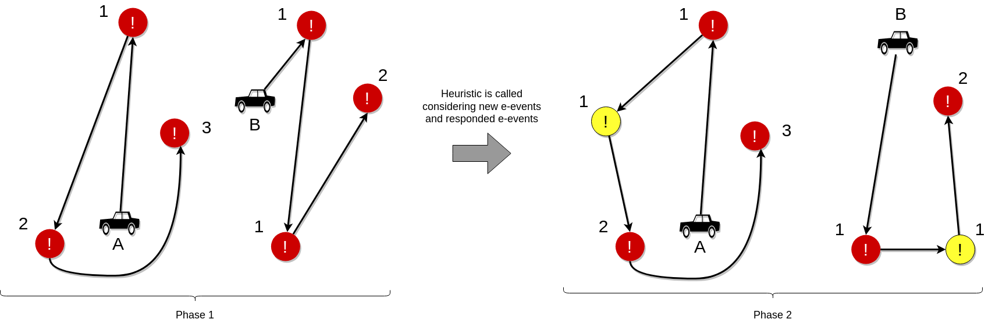

# IRONSTONE (Data-Oriented Approach for Routing Vehicles To Respond Emergency Events)

>IRONSTONE is a data-oriented approach that aims at defining vehicle routes for responding to emergency events (e-events) by consuming real-time traffic data. 

  

## Overview

This repository presents a quick start guide for IRONSTONE. IRONSTONE is an innovative approach that analyzes real-time traffic data and generates a graph representing the streets within a radius (e.g., 10 km) from the emergency event (i.e., e-event). Based on this graph, IRONSTONE employs a multi-start random constructive heuristic to schedule vehicles efficiently for responding to e-events. In its current version, IRONSTONE utilizes the Tomtom API to estimate travel times between the vehicle locations and the e-events. Additionally, historical data is employed to estimate the time required for responding to each e-event. Once a specific e-event is addressed, the proposed approach regenerates the routes, considering the new registered events and traffic conditions. IRONSTONE is designed with the primary objective of minimizing the total response time. The objective function is structured to minimize the sum of the times required to respond to each e-event. This ensures a swift and effective response to emergency situations.

## Quick Start Guide

For ensuring reproducibility, IRONSTONE has been implemented as a Jupyter Notebook. To execute IRONSTONE successfully, the user must have a computer with Jupyter Notebook version Anaconda3 installed. Additionally, a Tomtom API Key is required, which can be obtained for free in [Tom Tom](https://www.tomtom.com/)  website.

The following steps outline the execution process:

1. Obtain the Tomtom API Key from [Tom Tom](https://www.tomtom.com/) for free.
2. Open the Jupyter Notebook on your computer.
3. Locate and open the "Generate Graph" Notebook.
4. Run the cells in the "Generate Graph" file in the exact order they appear.
5. After the "Generate Graph" process is completed, locate and open the "Heuristic" Notebook.
6. Run the cells in the "Heuristic" file in the exact order they appear.

By following these steps and running the cells as indicated, IRONSTONE will be executed effectively, allowing you to use its capabilities for analyzing real-time traffic data and generating optimal vehicle response routes for emergency events.
